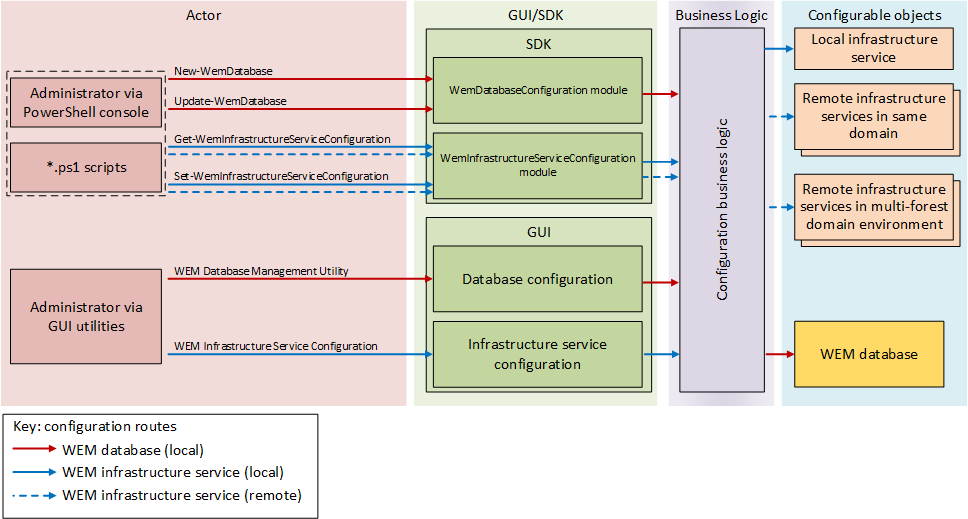

# Understanding the SDK

The Citrix Workspace Environment Management SDK allows you to perform various configuration operations.

## PowerShell modules

The Citrix Workspace Environment Management PowerShell modules allow you to:

* create and upgrade local and remote Workspace Environment Management databases

* perform administrative operations on local and remote infrastructure services, including those in multi-forest domains.

You can use run the provided cmdlets directly from the PowerShell console, or from PowerShell scripts.

The following illustration summarizes how configuring Workspace Environment Management using the PowerShell modules compares with using the standard GUIs.

